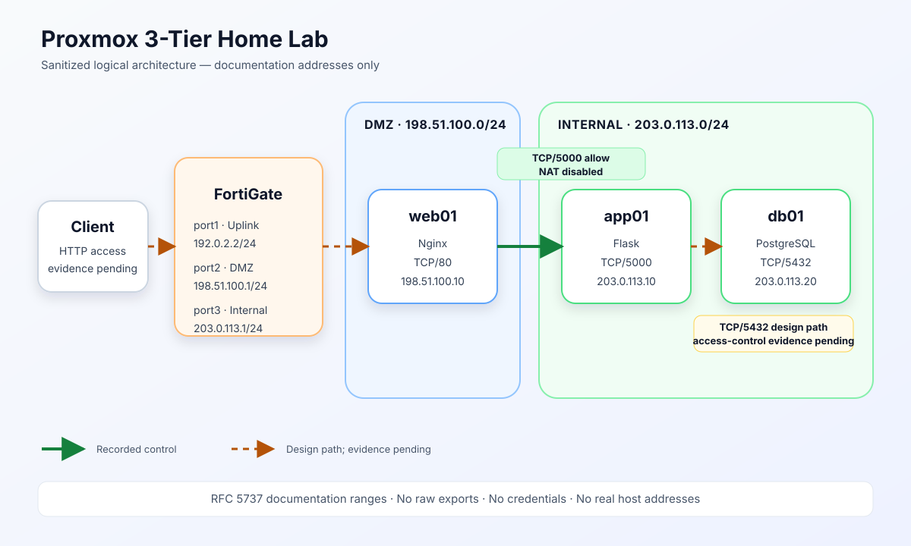

# Proxmox 3-Tier Home Lab



Proxmox VE 上に構築した Web / Application / Database の3層ホームラボを、公開用に再構成したポートフォリオです。これは個人学習・検証環境の記録であり、商用環境での実務経験を示すものではありません。

> [!IMPORTANT]
> このリポジトリにあるIPアドレス、オブジェクト名、設定例は公開用に置換・再構成しています。実環境の生設定やアドレスではありません。

## 目的

- FortiGateを境界にDMZと内部ネットワークを分離する
- Nginx / Flask / PostgreSQLの役割を3台に分ける
- 層間通信を必要な宛先・ポートに限定する考え方を確認する
- 通信経路ごとの切り分け手順を再現可能な形で残す

## 構成

| ゾーン | ノード | 役割 | 公開用アドレス | 待受ポート |
|---|---|---|---|---:|
| Uplink | FortiGate port1 | 上位ネットワーク接続 | `192.0.2.2/24` | — |
| DMZ | FortiGate port2 | DMZゲートウェイ | `198.51.100.1/24` | — |
| DMZ | web01 | Nginx | `198.51.100.10/24` | TCP/80 |
| Internal | FortiGate port3 | 内部ゲートウェイ | `203.0.113.1/24` | — |
| Internal | app01 | Flask | `203.0.113.10/24` | TCP/5000 |
| Internal | db01 | PostgreSQL | `203.0.113.20/24` | TCP/5432 |

`192.0.2.0/24`、`198.51.100.0/24`、`203.0.113.0/24`はRFC 5737の文書用アドレスです。

ここでいう「3層」はWeb / Application / Databaseの役割分離を指します。ネットワーク上のセキュリティゾーンはDMZとInternalで、app01とdb01は同じInternalセグメントです。そのためApp→DBの制御は、現在の構成ではFortiGateを通過する前提にせず、ホストファイアウォールやPostgreSQLの接続元制御を確認対象にします。

## 設計・設定として記録できていること

- FortiGateのport2をDMZ、port3をInternalとして分離
- DMZのweb01でNginxをTCP/80で待受
- Internalのapp01でFlaskをTCP/5000で待受
- Internalのdb01でPostgreSQLをTCP/5432で待受
- web01からapp01へのTCP/5000を許可し、当該ポリシーではNATを無効化
- web01でSELinuxの`httpd_can_network_connect`を有効化

## 公開資料の読み方

このリポジトリでは、内容を次の3段階に分けています。

| 表記 | 意味 |
|---|---|
| 記録済み | 非公開のラボメモで設定内容を確認できたもの |
| 公開用再構成 | 記録済みの意図を、文書用アドレスと一般名で書き直した例 |
| 確認待ち | コマンド出力やスクリーンショットが未収集で、成功を断定していないもの |

現時点で、サービス配置、Web→Appの許可ポリシー、NAT無効、web01のSELinux設定は「記録済み」です。一方、Client→Web、App→DB、エンドツーエンドのHTTP応答は公開可能な証跡が未収集のため「確認待ち」です。

## セキュリティ上の考え方

- Web層だけをDMZに配置し、App / DB層は内部側に配置
- Web→Appは宛先とTCP/5000を限定
- 層間通信で不要なNATを行わず、送信元を識別できる設計
- Nginxから上流へ接続するためのSELinuxブール値だけを明示的に有効化
- 公開物には実IP、認証情報、生の設定バックアップ、鍵、証明書を含めない

App→DBのTCP/5432制御、管理アクセスの制限、ログ設定、TLS化は、公開可能な設定証跡を追加してから記載を確定します。

## リポジトリ構成

```text
.
├── README.md
├── LICENSE
├── SECURITY.md
├── configs/
│   ├── README.md
│   ├── inventory.example.yml
│   ├── fortigate/
│   ├── web01/
│   ├── app01/
│   └── db01/
├── docs/
│   ├── architecture.md
│   ├── architecture.svg
│   ├── evidence-request.md
│   ├── publication-checklist.md
│   └── validation-matrix.md
├── scripts/
│   └── prepublish-audit.sh
└── troubleshooting/
    ├── app-to-db.md
    └── web-to-app.md
```

## 確認手順

1. [検証マトリクス](docs/validation-matrix.md)で、記録済みと確認待ちを区別します。
2. [必要な追加証跡](docs/evidence-request.md)の最小コマンドだけを実行します。
3. 出力中のIP、ホスト名、ユーザー名、パスを伏せてから追記します。
4. `./scripts/prepublish-audit.sh`を実行します。
5. [公開前チェックリスト](docs/publication-checklist.md)を目視で確認します。

## トラブルシューティング

- [Web→App（TCP/5000）](troubleshooting/web-to-app.md)
- [App→DB（TCP/5432）](troubleshooting/app-to-db.md)

切り分けは、サービス待受 → ローカル接続 → 経路 → FortiGateポリシー → OS側制御 → アプリケーションログ、の順で実施します。

## 今後の更新候補

- 公開可能な試験結果を追加し、確認待ち項目を更新
- App→DBの最小権限ポリシーを設定例とともに記録
- 管理用ネットワークと管理元制限を明文化
- HTTPS化と証明書管理方針を追加
- FortiGateと各サーバーのログを使った障害切り分け例を追加

## License

MIT License。詳細は[LICENSE](LICENSE)を参照してください。
