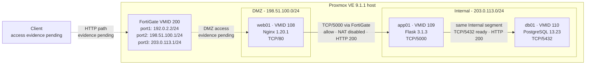

# 構成図

以下は公開用に再構成した論理構成です。IPアドレスはすべてRFC 5737の文書用アドレスであり、実環境の値ではありません。

## 凡例

- 実線: ラボ内で設定と動作を確認済み
- 破線: 構成上の通信経路だが動作証跡が未収集

Web→AppはFortiGateのDMZ→Internalポリシーを通過します。App→DBは同じInternalセグメント内の通信であり、FortiGateを通過しません。図の3層はアプリケーションロールを表し、セキュリティゾーンはDMZとInternalの2つです。

SVG版は[architecture.svg](architecture.svg)です。
