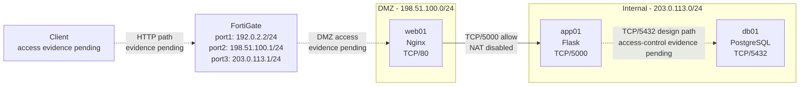

# 構成図

以下は公開用に再構成した論理構成です。IPアドレスはすべてRFC 5737の文書用アドレスであり、実環境の値ではありません。

```mermaid
flowchart LR
    Client["Client\naccess evidence pending"]
    FW["FortiGate\nport1: 192.0.2.2/24\nport2: 198.51.100.1/24\nport3: 203.0.113.1/24"]

    subgraph DMZ[DMZ - 198.51.100.0/24]
        Web["web01\nNginx\nTCP/80"]
    end

    subgraph Internal[Internal - 203.0.113.0/24]
        App["app01\nFlask\nTCP/5000"]
        DB["db01\nPostgreSQL\nTCP/5432"]
    end

    Client -. "HTTP path\nevidence pending" .-> FW
    FW -. "DMZ access\nevidence pending" .-> Web
    Web -->|"TCP/5000 allow\nNAT disabled"| App
    App -. "TCP/5432 design path\naccess-control evidence pending" .-> DB
```

## 凡例

- 実線: 非公開ラボメモで制御内容を確認済み
- 破線: 構成上の通信経路だが、公開可能な動作証跡またはポリシー証跡が未収集

SVG版は[architecture.svg](architecture.svg)です。
